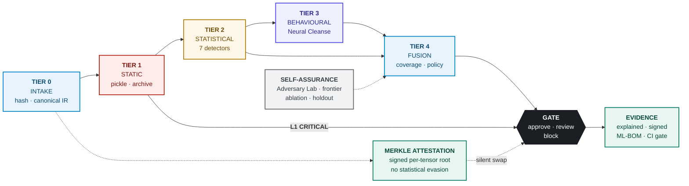

# SentinelWeights — System Architecture

Two Mermaid views of the same system. Both render in Cursor's markdown preview and on GitHub.

- The **deck view** below is compact by design and is what the deck build rasterises into
  [`web/public/img/architecture.png`](web/public/img/architecture.png) for slide 5 of the
  Phase-1 submission.
- The **detailed view** further down names every detector module and is the one to read.

Every node maps to a real module under [`backend/`](backend).

---

## Deck view — rendered onto slide 5

<!-- render:slide -->

---

## Detailed view — every detector named

```mermaid
flowchart LR
  ART["<b>Model<br/>artifact</b><br/>safetensors<br/>pt · npz<br/>onnx"]

  subgraph T0["TIER 0 · INTAKE ~1ms"]
    direction TB
    HASH["<b>Hash + cache</b><br/>SHA-256<br/>addressed<br/>rescans free"]
    IR["<b>Canonical IR</b><br/>ir.py<br/>tensors · dtypes<br/>shapes · metadata"]
    HASH --> IR
  end

  subgraph T1["TIER 1 · STATIC 2-16ms"]
    direction TB
    PICK["<b>l1_static</b><br/>pickle disassembly<br/>stack-aware<br/>never executed"]
    ARCH["<b>l1_static</b><br/>archive + metadata<br/>traversal · bombs<br/>binary blobs"]
  end

  subgraph T2["TIER 2 · STATISTICAL parallel per tensor"]
    direction TB
    BP["<b>l2_bitplane</b><br/>entropy vs<br/>dtype baseline"]
    WIN["<b>l2_window</b><br/>multi-scale +<br/>per-channel"]
    RND["<b>l2_randfeat</b><br/><b>l2_distdiv</b><br/>bootstrapped null"]
    PC["<b>l2_contract</b><br/>freed planes<br/>must be zero"]
    DS["<b>l2_deadspace</b><br/><b>l2_crosslayer</b>"]
  end

  subgraph T3["TIER 3 · BEHAVIOURAL gated"]
    direction TB
    NC["<b>l3_backdoor</b><br/>Neural Cleanse<br/>trigger search<br/>+ MAD index"]
  end

  subgraph T4["TIER 4 · DECISION"]
    direction TB
    FUSE["<b>l4_fusion</b><br/>100·σ(b+Σwᵢzᵢ)<br/>6 open weights"]
    COV["<b>coverage.py</b><br/>ran · N-A<br/>skipped<br/>failed-safe"]
    POL["<b>policy.py</b><br/>deterministic<br/>overrides"]
    FUSE --> POL
    COV --> POL
  end

  GATE{{"<b>GATE</b><br/>approve<br/>caveats<br/>review<br/>hard block<br/>quarantine"}}

  subgraph EV["EVIDENCE · signed"]
    direction TB
    NAR["<b>narrative.py</b><br/>heatmap · Δk<br/>opcodes · trigger"]
    BOM["<b>builder.py</b><br/>ML-BOM<br/>timeline"]
    SIG["<b>sign_verify.py</b><br/>Ed25519<br/>live verify"]
  end

  MERK["<b>attest.py</b><br/>Merkle root over<br/>per-tensor leaves<br/>signed + ledgered"]

  subgraph ASSURE["SELF-ASSURANCE"]
    direction TB
    ADV["<b>adversary.py</b><br/>attack it live"]
    FRO["<b>frontier.py</b><br/>33 configs<br/>blind spots named"]
    ABL["<b>ablation.py</b><br/>+ alt controls"]
    HOL["<b>holdout.py</b><br/>never calibrated"]
    LIN["<b>lineage.py</b><br/><b>sampled.py</b>"]
  end

  SURF["<b>app.py · cli.py</b><br/>REST · WS<br/>CLI gate · CI/CD<br/>air-gapped"]

  ART --> T0
  IR --> T1
  T1 -->|clears| T2
  T1 -->|"<b>L1 CRITICAL</b><br/>short-circuit"| GATE
  T2 -->|odd| T3
  T2 --> T4
  T3 --> T4
  T4 --> GATE
  GATE --> EV
  ART -.->|baseline| MERK
  MERK -.->|"silent<br/>substitution"| GATE
  EV --> SURF
  ASSURE -.->|"proves<br/>coverage"| T4

  classDef intake fill:#E8F4FD,stroke:#0284C7,stroke-width:1.5px,color:#0C4A6E
  classDef static fill:#FDECEA,stroke:#B42318,stroke-width:1.5px,color:#7A1710
  classDef stat fill:#FEF6E7,stroke:#B07D0C,stroke-width:1.5px,color:#6B4C07
  classDef behav fill:#EEF0FE,stroke:#4F46E5,stroke-width:1.5px,color:#2E2A8C
  classDef decide fill:#E8F4FD,stroke:#0284C7,stroke-width:1.5px,color:#0C4A6E
  classDef ev fill:#E8F6F1,stroke:#0E7C66,stroke-width:1.5px,color:#08483B
  classDef assure fill:#F1F2F4,stroke:#63666A,stroke-width:1.5px,color:#3A3D40
  classDef gate fill:#1B1F24,stroke:#1B1F24,stroke-width:2px,color:#FFFFFF
  classDef art fill:#FFFFFF,stroke:#63666A,stroke-width:1.5px,color:#23282E

  class ART,SURF art
  class HASH,IR intake
  class PICK,ARCH static
  class BP,WIN,RND,PC,DS stat
  class NC behav
  class FUSE,COV,POL decide
  class NAR,BOM,SIG ev
  class MERK ev
  class ADV,FRO,ABL,HOL,LIN assure
  class GATE gate
```

---

## Reading the diagram

- **The funnel is the cost argument.** Tiers 0–2 are `O(N)` in parameter count with full
  per-tensor parallelism, so they run on 100% of models. Tier 3 is `O(classes × steps)` and is
  therefore gated to the flagged minority. Measured end to end: mean 203 ms, p95 218 ms.
- **The short-circuit edge matters.** An L1 CRITICAL finding routes straight to the gate and the
  later tiers are marked *Not applicable* — never *passed*. We do not claim coverage we did not earn.
- **Attestation is a parallel control, not a later stage.** Statistics ask *do these numbers look
  wrong*, which a sufficiently careful attacker can win. Attestation asks *are these the numbers we
  signed*, which has no statistical evasion. That dashed path is what catches the kept-plane payload
  our own statistics approve.
- **Self-assurance feeds the decision layer.** The Adversary Lab, frontier sweep, ablation and
  sealed holdout are not marketing artifacts — they set and justify the thresholds Tier 4 uses.
